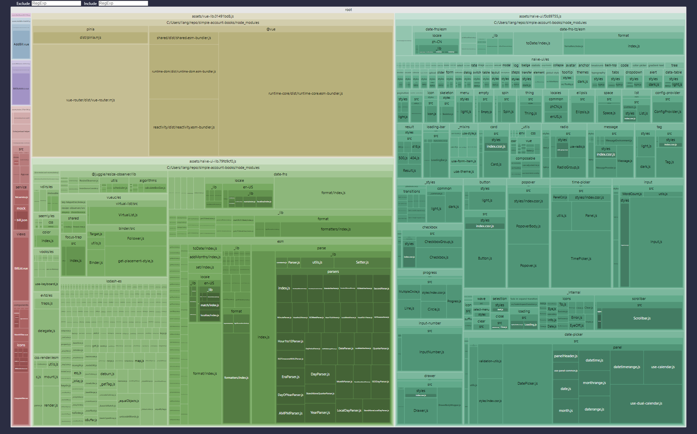

<h1 align="center">简易记账本</h1>

<p align="center">
  <a href="https://github.com/liangpengyv/simple-account-books/actions/workflows/test.yml"></a>
  <a href="https://nodejs.org/zh-cn/download/releases/"></a>
  <a href="https://cn.vuejs.org/"></a>
  <a href="https://standardjs.com/readme-zhcn.html"></a>
</p>

<br>


> [**👆 XMind 前端面试大作业**](https://github.com/xmindltd/hiring/blob/master/frontend-1/README.md)
>
> **预览地址：**[https://simple-account-books.laoliang.ink](https://simple-account-books.laoliang.ink)
>
> **我的简历：**[https://resume.laoliang.ink](https://resume.laoliang.ink)

<br><br>

- [一、介绍](#一介绍)
  - [1.1 功能特性](#11-功能特性)
    - [1.1.1 模块速览](#111-模块速览)
    - [1.1.2 一些加花](#112-一些加花)
  - [1.2 实现过程](#12-实现过程)
    - [1.2.1 技术选型](#121-技术选型)
    - [1.2.2 项目搭建](#122-项目搭建)
    - [1.2.3 必要的测试](#123-必要的测试)
    - [1.2.4 产物优化](#124-产物优化)
    - [1.2.5 CI/CD](#125-cicd)
    - [1.2.6 问题与解决方案](#126-问题与解决方案)
- [二、运行](#二运行)
  - [2.1 环境准备](#21-环境准备)
  - [2.2 开始](#22-开始)
  - [2.3 构建](#23-构建)
  - [2.4 测试](#24-测试)

<br><br>

## 一、介绍

### 1.1 功能特性

#### 1.1.1 模块速览

- 账单列表展示
- 月份筛选
- 添加账单
- 所选月份收入和支出总额
- 对分类二次筛选
- 所选月份账单分类统计排序

#### 1.1.2 一些加花

- 添加首屏 Loading，缓解网络延迟等待焦虑
- 数据加载骨架屏，准确传达应用状态
- 添加路由过渡动画，页面跳转更加平滑
- 支持跟随系统设置的明暗主题自动切换

### 1.2 实现过程

#### 1.2.1 技术选型

浏览 Xmind JD，针对前端，有 Vue.js 技术栈需求，借着 Vue3 正式版发布不久，除关注，尚未实践应用过，遂选择 [Vue3](https://cn.vuejs.org/) 作为开发框架。

分析需求，应用需要拆分多个页面、页面间拥有共享数据需求，遂选择 [Pinia](https://pinia.vuejs.org/zh/)、[VueRouter](https://router.vuejs.org/zh/) 库加入项目依赖。

对比多款支持 Vue3 的 UI 库，选择风格俏皮的 [Naive UI](https://www.naiveui.com/zh-CN/os-theme)。

#### 1.2.2 项目搭建

**划分模块** 到各个文件夹：

```sh
src
  ├─assets      # 资源文件
  ├─components  # 业务组件
  │  ├─common   # 公共组件
  │  └─icons    # 图标
  ├─router      # 路由配置
  ├─service     # 网络请求
  ├─stores      # 共享数据
  ├─typing      # 类型封装
  ├─utils       # 工具函数
  ├─views       # 路由组件
  ├─App.vue     # 根组件
  └─main.js     # 应用入口
```

**代码规范** 使用 JavaScript Standard Style，继承 vue3 recommended，生效 `.vue` 文件的 `script` 代码块 及 `.js` 文件。

```javascript
// .eslintrc.js
module.exports = {
  extends: [
    'plugin:vue/vue3-recommended',
    'standard'
  ],
  // ...
}

```

同时，为使用的编辑器 VSCode，添加工作区配置，切换 VSCode 使用当前项目 ESLint 规则格式化代码。

```json
// .vscode/settings.json
{
  "eslint.format.enable": true
  // ...
}
```

这需要在 VSCode 中安装 [ESLint](https://marketplace.visualstudio.com/items?itemName=dbaeumer.vscode-eslint) 插件。

因此，我们将插件安装推荐，添加进工作区：

```json
// .vscode/extensions.json
{
  "recommendations": [
    "dbaeumer.vscode-eslint", // ESLint 插件
    "Vue.volar", // 为 Vue3 文件提供额外的支持
    "ZixuanChen.vitest-explorer", // 用于运行调试 基于 vitest 的代码测试，见下方
    "ms-playwright.playwright" // 用于运行调试 基于 playwright 的前端 e2e 测试，见下方
  ]
}
```

#### 1.2.3 必要的测试

**单元测试**:


由于使用 [vite](https://cn.vitejs.dev/) 作为项目构建工具，遂选用官方推荐的首选测试框架 [vitest](https://cn.vitest.dev/guide/why.html)，针对 vite 项目，在开发、构建和测试期间，可以共享一个通用的转换容器。同时可以通过相同的插件 API 进行扩展，与 Vite 形成完美的集成。

**e2e 测试**：


针对模拟仿真的端到端测试，这里选用个人熟悉的 [Playwright](https://playwright.dev/)，它支持所有现代渲染引擎，支持本地和 CI 进行测试，有着易用的 API。

#### 1.2.4 产物优化

**三方组件按需引入**：

按需引入第三方组件方式，支持 TreeShaking，缩小打包产物

```javascript
// e.g.
import { NButton } from 'naive-ui'
```

**路由懒加载**：

除首页外，其他路由页面使用懒加载，使打包首屏资源进一步降低

```javascript
// e.g.
component: () => import('../views/AddBill.vue')
```

**chunk 分片**：

使用 [rollup-plugin-visualizer](https://www.npmjs.com/package/rollup-plugin-visualizer) 插件，分析构建产物。

> vite 是基于 rollup 之上的，所以支持 rollup 插件
> 


**优化**：

- 合并很少变动的 `vue` 三件套依赖包
- 拆分 `naive-ui` 依赖的，同样很少变动的 `date-fns`、`lodash-es` 等依赖包，并合并为一个 chunk
- 拆分 `naive-ui` 自身自己模块部分，这一部分在项目按需引入新组件时，时常变动，单独作为一个 chunk
- 以上拆分与合并的同时，兼顾 “chunk 数” 和 “单个 chunk 体积” 的平衡

```javascript
// rollup config
manualChunks: {
  'vue-lib': ['vue', 'pinia', 'vue-router'],
  'naive-ui-lib': ['date-fns', 'date-fns-tz', 'vueuc', 'lodash-es'],
  'naive-ui': ['naive-ui']
}
```

#### 1.2.5 CI/CD

**GitHub Action 自动运行测试**：

使用 GitHub Action 在每次 `push` 代码时自动运行项目测试，针对 开发 与 CI 环境，输出不同形式测试数据，便于场景应用。

- GitHub Action 配置：[test.yml](./.github/workflows/test.yml)
- vitest UT 配置：[vitest.config.js](./vitest.config.js)
- playwright e2e 配置：[playwright.config.js](./playwright.config.js)

**AWS Amplify 自动构建部署**：

使用 [AWS Amplify](https://aws.amazon.com/cn/amplify/) 托管 web 应用，并配置 `push` 仓库自动触发 构建&部署。

- AWS Amplify 构建配置：[amplify.yml](./amplify.yml)

一键部署👆

[](https://console.aws.amazon.com/amplify/home#/deploy?repo=https://github.com/liangpengyv/simple-account-books)

#### 1.2.6 问题与解决方案

**package-lock.json 版本控制冲突问题**：

由于不同的人员机器上安装了不同版本的 npm，配置不同的 npm 源，容易导致 `package-lock.json` 文件时常被修改，从而 git diff 大面积变更。除了约定协作人员使用相同或相近的工具外，不同的 npm 源，也是时常造成冲突的一大原因，这里，在项目级别指定统一的 npm registry，并限定 node 最低版本。

```json
// .npmrc
registry=https://registry.npmmirror.com/
engine-strict=true

// package.json
"engines": {
  "node": ">= 14.18.0"
},
```

**VSCode 格式化代码与 ESLint 规则冲突问题**：

之前常用，出厂默认豪华配置的 WebStorm，它支持一键解析 ESLint 配置规则，并应用其作为格式化规则。

而 VSCode 只是自带一些基础的格式化功能，除此之外，广泛被使用的 Prettier 插件格式化功能虽然强大，但是面临和 ESLint 规则冲突的问题。

解决方法无外乎：

- 手动逐条为 Prettier 配置与 ESLint 冲突的规则
- 使用 [eslint-config-prettier](https://github.com/prettier/eslint-config-prettier) 关闭所有不必要的或可能与 Prettier 冲突的 ESLint 规则
- 使用 [eslint-plugin-prettier](https://github.com/prettier/eslint-plugin-prettier) 将 Prettier 作为 ESLint 规则运行，并将差异报告为单个 ESLint 问题
- 直接在 ESLint 配置中使用 Prettier 规则集

以上解决方法，

- 要么 配置繁琐
- 要么 无法完全按照希望的 ESLint 规则格式化代码
- 要么 忍受通篇碍眼的错误警告
- 要么 背离初衷，完全放弃 自定义的 ESLint 规则，使用 Prettier 规则集

在不远的曾经，短暂的使用过 VSCode 编辑 带有 ESLint 配置的项目，记得当时 ESLint 只有检测功能，没有格式化功能。当时就觉得这很劝退，也因此除了打开临时文本文件，几乎没有使用 VSCode 开发过项目。

然而，这次再次打开 [ESLint VSCode 插件官网](https://marketplace.visualstudio.com/items?itemName=dbaeumer.vscode-eslint)，惊讶的发现，它已经不知道什么时候，支持了使用项目配置的 ESLint 规则进行格式化代码。

只不过，当前还需要手动激活启用：

```json
eslint.format.enable: true # 启用 ESLint 作为验证文件的格式化程序
```

添加进工作区 VSCode 配置 [settings.json](./.vscode/settings.json) 文件，`git add` 加入版本库追踪。

所有协作者，又统一环境了。

## 二、运行

### 2.1 环境准备

- node（注：>= 14.18.0）
- npm

### 2.2 开始

- git clone
- cd simple-account-books
- npm install
- npm run dev

### 2.3 构建

- npm run build
- npm run preview

### 2.4 测试

- npm run test
- npm run test:unit
- npm run test:unit:watch
- npm run test:e2e
- npm run test:e2e:headed