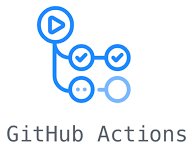

<h1 align="center">简易记账本</h1>

<p align="center">
  <a href="https://github.com/liangpengyv/simple-account-books/actions/workflows/test.yml"></a>
  <a href="https://nodejs.org/zh-cn/download/releases/"></a>
  <a href="https://cn.vuejs.org/"></a>
  <a href="https://standardjs.com/readme-zhcn.html"></a>
</p>

<br>


> [**👆 XMind 前端面试大作业**](https://github.com/xmindltd/hiring/blob/master/frontend-1/README.md)
>
> **预览地址：**[https://simple-account-books.laoliang.ink](https://simple-account-books.laoliang.ink)
>
> **我的简历：**[https://resume.laoliang.ink](https://resume.laoliang.ink)

<br><br>

- [1 功能特性](#1-功能特性)
  - [1.1 模块速览](#11-模块速览)
  - [1.2 一些加花](#12-一些加花)
- [2 实现过程](#2-实现过程)
  - [2.1 技术选型](#21-技术选型)
  - [2.2 项目搭建](#22-项目搭建)
  - [2.3 必要的测试](#23-必要的测试)
  - [2.4 产物优化](#24-产物优化)
  - [2.5 CI/CD](#25-cicd)
  - [2.6 问题\&解决](#26-问题解决)
- [3 运行](#3-运行)
  - [3.1 环境准备](#31-环境准备)
  - [3.2 开始](#32-开始)
  - [3.3 构建](#33-构建)
  - [3.4 测试](#34-测试)

<br><br>

# 1 功能特性

## 1.1 模块速览

- 1️⃣ 账单列表展示
- 2️⃣ 月份筛选
- 3️⃣ 添加账单
- 4️⃣ 所选月份收入和支出总额
- 5️⃣ 对分类二次筛选
- 6️⃣ 所选月份账单分类统计排序

## 1.2 一些加花

- 🎉 添加首屏 Loading，缓解网络延迟等待焦虑
- 🎉 数据加载骨架屏，准确传达应用状态
- 🎉 添加路由过渡动画，页面跳转更加平滑
- 🎉 支持跟随系统设置的明暗主题自动切换

# 2 实现过程

## 2.1 技术选型

浏览 Xmind JD，针对前端，有 Vue.js 技术栈需求，借着 Vue3 正式版发布不久，除关注一些新特性外，尚未实践应用过，遂选择 [Vue3](https://cn.vuejs.org/) 作为开发框架。

分析需求，应用需要 多个页面、页面间共享数据，遂选择 [VueRouter](https://router.vuejs.org/zh/)、[Pinia](https://pinia.vuejs.org/zh/) 加入项目依赖。

对比多款支持 Vue3 的 UI 库，选择风格俏皮的 [Naive UI](https://www.naiveui.com/zh-CN/os-theme)。

## 2.2 项目搭建

**划分模块**：

```sh
├─e2e           # e2e测试
└─src
  ├─assets      # 资源文件
  ├─components  # 业务组件
  │  ├─common   # 公共组件
  │  └─icons    # 图标
  ├─router      # 路由配置
  ├─service     # 网络请求
  ├─stores      # 共享数据
  ├─typing      # 类型封装
  ├─utils       # 工具函数
  ├─views       # 路由组件
  ├─App.vue     # 根组件
  └─main.js     # 应用入口
```

**代码规范** 使用 [JavaScript Standard Style](https://standardjs.com/readme-zhcn.html)，继承 vue3 recommended，生效 `.vue` 文件的 `script` 代码块，以及 `.js` 文件。

```javascript
// .eslintrc.js
module.exports = {
  extends: [
    'plugin:vue/vue3-recommended',
    'standard'
  ],
  // ...
}

```

同时，为使用的编辑器 VSCode，添加工作区配置，切换 VSCode 使用当前项目 ESLint 规则格式化代码。

```javascript
// .vscode/settings.json
{
  "eslint.format.enable": true
  // ...
}
```

> 这需要在 VSCode 中安装 [ESLint](https://marketplace.visualstudio.com/items?itemName=dbaeumer.vscode-eslint) 插件。

因此，我们将插件安装推荐，添加进工作区：

```javascript
// .vscode/extensions.json
{
  "recommendations": [
    "dbaeumer.vscode-eslint", // ESLint 插件
    "Vue.volar", // 为 Vue3 文件提供额外的支持
    "ZixuanChen.vitest-explorer", // 用于运行调试 基于 vitest 的代码测试，见下方
    "ms-playwright.playwright" // 用于运行调试 基于 playwright 的前端 e2e 测试，见下方
  ]
}
```

👍 这样，不同的协作者，使用 VSCode 打开项目时，会收到一致的插件安装提示，有助于统一开发环境。

## 2.3 必要的测试

**单元测试**:


由于使用 [vite](https://cn.vitejs.dev/) 作为项目构建工具，遂选用官方推荐的测试框架 [vitest](https://cn.vitest.dev/guide/why.html)，针对 vite 项目，在开发、构建和测试期间，可以共享一个通用的转换容器。同时可以通过相同的插件 API 进行扩展，与 Vite 形成完美的集成。

**e2e 测试**：


针对模拟仿真的端到端测试，这里选用个人熟悉的 [Playwright](https://playwright.dev/)，它支持所有现代渲染引擎，支持本地和 CI 进行测试，有着易用的 API。

## 2.4 产物优化

**三方组件按需引入**：

按需引入第三方组件方式，支持 TreeShaking，缩小打包产物。

```javascript
// e.g.
import { NButton } from 'naive-ui'
```

**路由懒加载**：

除首页外，其他路由页面使用懒加载，使打包首屏资源进一步降低。

```javascript
// e.g.
component: () => import('../views/AddBill.vue')
```

**chunk 分片**：

使用 [rollup-plugin-visualizer](https://www.npmjs.com/package/rollup-plugin-visualizer) 插件，分析构建产物。

> vite 是基于 rollup 之上的，所以支持 rollup 插件
> 


**优化**：

- ✅ 合并很少变动的 `vue` 三件套依赖包
- ✅ 拆分 `naive-ui` 依赖的、同样很少变动的 `date-fns`、`lodash-es` 等，并合并为一个 chunk
- ✅ 拆分 `naive-ui` 自身组件模块部分，这一部分在项目按需引入新组件时，时常变动，单独作为一个 chunk
- 👍 以上拆分与合并的同时，兼顾 **“chunk 数”** 和 **“单个 chunk 体积”** 的 **平衡**

```javascript
// rollup config
manualChunks: {
  'vue-lib': ['vue', 'pinia', 'vue-router'],
  'naive-ui-lib': ['date-fns', 'date-fns-tz', 'vueuc', 'lodash-es'],
  'naive-ui': ['naive-ui']
}
```

## 2.5 CI/CD

**GitHub Action 自动运行测试**：



使用 [GitHub Action](https://github.com/liangpengyv/simple-account-books/actions/workflows/test.yml) 在每次 `push` 代码时自动运行项目测试，针对 **开发** 与 **CI** 环境，输出不同形式的测试报告，便于场景应用。

- GitHub Action 配置：[test.yml](./.github/workflows/test.yml)
- vitest UT 配置：[vitest.config.js](./vitest.config.js)
- playwright e2e 配置：[playwright.config.js](./playwright.config.js)

**AWS Amplify 自动构建部署**：


使用 [AWS Amplify](https://aws.amazon.com/cn/amplify/) 托管 web 应用，并配置 `push` 仓库自动触发 构建&部署。

- AWS Amplify 构建配置：[amplify.yml](./amplify.yml)

一键部署 👇

<a href="https://console.aws.amazon.com/amplify/home#/deploy?repo=https://github.com/liangpengyv/simple-account-books">
  
</a>

## 2.6 问题&解决

**package-lock.json 版本控制冲突问题**：

由于不同的人员机器上安装了不同版本的 node.js，配置不同的 npm 源，容易导致 `package-lock.json` 文件时常被修改，从而 `git diff` 大面积变更。除了约定协作人员使用相同或相近版本的工具外，不同的 npm 源，也是时常造成冲突的一大原因，这里，在项目级别指定统一的 npm registry，并限定 node 最低版本。

```javascript
// .npmrc
registry=https://registry.npmmirror.com/
engine-strict=true

// package.json
"engines": {
  "node": ">= 14.18.0"
},
```

**VSCode 格式化代码与 ESLint 规则冲突问题**：

之前常用，出厂默认豪华配置的 [WebStorm](https://www.jetbrains.com/)，它支持一键解析 ESLint 配置规则，并应用其作为格式化规则。

而 VSCode 只是自带一些基础的格式化功能，除此之外，广泛被使用的 [Prettier](https://marketplace.visualstudio.com/items?itemName=esbenp.prettier-vscode) 插件格式化功能虽然强大，但是面临和 ESLint 规则冲突的问题。

解决方法无外乎：

- 😦 手动逐条修改 Prettier 的配置与 ESLint 冲突的规则
- 😦 使用 [eslint-config-prettier](https://github.com/prettier/eslint-config-prettier) 关闭所有不必要的或可能与 Prettier 冲突的 ESLint 规则
- 😦 使用 [eslint-plugin-prettier](https://github.com/prettier/eslint-plugin-prettier) 将 Prettier 作为 ESLint 规则运行，并将差异报告为单个 ESLint 问题
- 😦 直接在 ESLint 配置中使用 Prettier 规则集

以上解决方法，

- 🤷 要么 配置繁琐
- 🤷 要么 无法完全按照希望的 ESLint 规则格式化代码
- 🤷 要么 忍受通篇碍眼的错误警告
- 🤷 要么 背离初衷，完全放弃 自定义的 ESLint 规则，转而使用 Prettier 规则集

在不远的曾经，短暂的使用过 VSCode 编辑 带有 ESLint 配置的项目，记得当时 ESLint 插件 只有代码检测功能，没有格式化功能。当时就觉得这很劝退，也因此除了打开临时文本文件，几乎没有使用 VSCode 开发过项目。

然而，这次再次打开 [ESLint VSCode 插件官网](https://marketplace.visualstudio.com/items?itemName=dbaeumer.vscode-eslint)，惊讶的发现，不知道什么时候，它已经支持使用项目配置的 ESLint 规则，进行格式化代码了。

只不过，当前还需要手动激活启用：

```javascript
eslint.format.enable: true # 启用 ESLint 作为验证文件的格式化程序
```

👆 添加进工作区 VSCode 配置 [settings.json](./.vscode/settings.json) 文件，`git add` 加入版本库追踪。

👏 所有协作者，又统一环境了。

# 3 运行

## 3.1 环境准备

- git
- node（注：>= 14.18.0）
- npm

## 3.2 开始

**克隆代码**：

```sh
git clone https://github.com/liangpengyv/simple-account-books.git
```

**安装依赖**：

```sh
cd simple-account-books
npm install
```

**启动开发调试**：

```sh
npm run dev
```

此时，可以在 `http://localhost:5173` 打开开发环境下的 web 应用。

## 3.3 构建

**开始编译打包**：

```sh
npm run build
```

产物输出在 `dist` 文件夹下。

**本地预览打包产物**：

```sh
npm run preview
```

将在本地启动一个开发服务器，运行 `dist` 目录下的构建产物，我们可以打开 `http://localhost:4173` 预览打包产物。

## 3.4 测试

**运行所有测试**：（包括：Unit Test & e2e Test）

```sh
npm run test
```

构建日志将输出在终端中。

**运行单元测试**：

```sh
npm run test:unit
```

**在浏览模式下运行单元测试**：

```sh
npm run test:unit:watch
```

任务将暂停在终端会话中，并监听代码更改，并在更改时重新运行测试。这适用于 编写单元测试 期间，方便实时查看结果和调试。

> 更多命令详见：[【Command Line Interface | Vitest】](https://cn.vitest.dev/guide/cli.html)
>
> 安装 IDE 插件：[【IDE Integrations | Vitest】](https://cn.vitest.dev/guide/ide.html)

**运行 e2e 测试**：

```sh
npm run test:e2e
```

这将在浏览器无头模式下，后台运行所有 e2e 测试用例，这将获得较快的速度。

**在有头模式下运行 e2e 测试**：

```sh
npm run test:e2e:headed
```

这将在浏览器有头模式下运行测试，我们将看到 本地 Chrome 程序（根据项目 [playwright.config.js](./playwright.config.js) 配置设定）被启动，并自动根据测试用例代码执行相关动作。

> 更多命令详见：[【Command line | Playwright】](https://playwright.dev/docs/test-cli)
>
> 安装 IDE 插件：[【Getting started - VS Code | Playwright】](https://playwright.dev/docs/getting-started-vscode)

